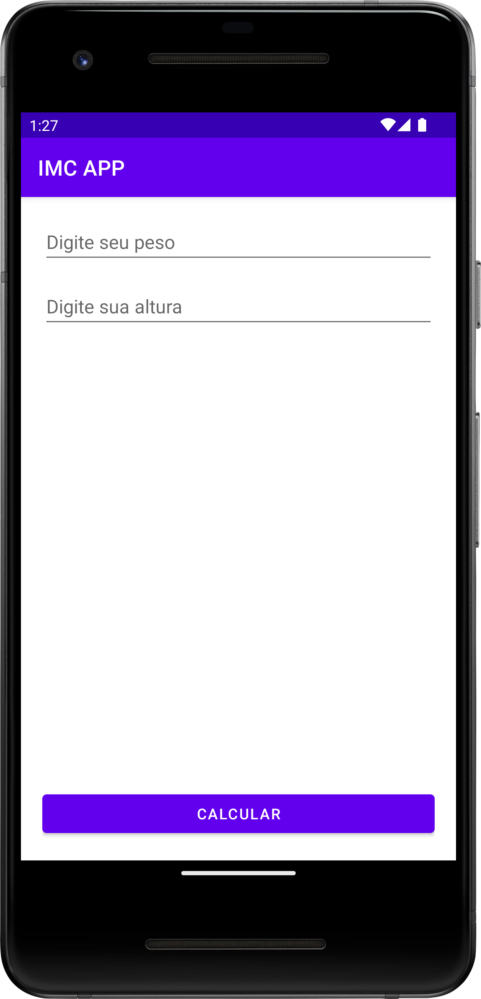
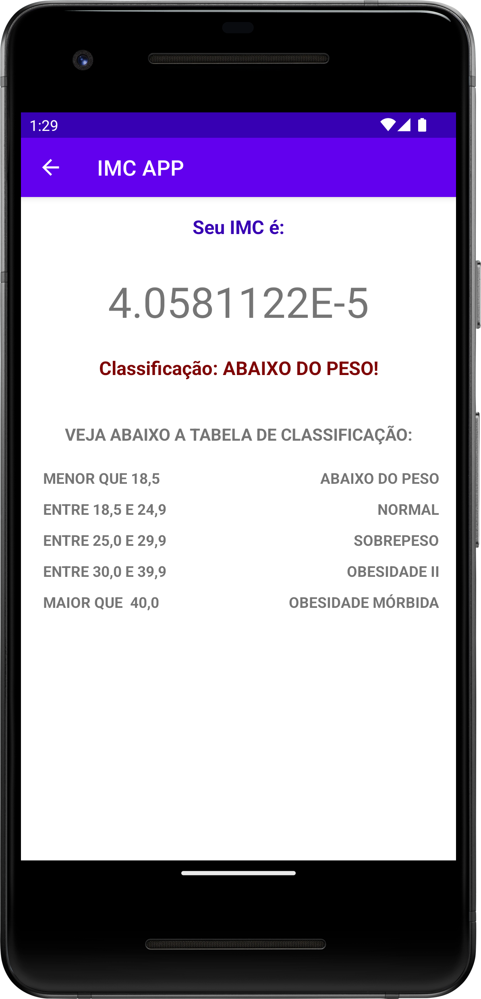

# Calculadora de IMC
 My first App in Android is a IMC calculator., I developed this app in the 10D challenge in the DevSpace Community.

## :camera_flash: Screenshots
&emsp;

## Tecnologies
* Kotlin
* Activity for screen hosts
* ViewGroup
    * RelativeLayout
    * LinearLayout
* UI Components
    * TextView
    * EditText
    * Button
    * TableLayout
* Toast to display messages
* Explicity Intent to open the second Activity
* FindViewById to recovery the UI Components
* Strings resource to concatenate the texts

## TODO

- Improve the UI 

## Author
Lucas Lemes de Siqueira (follow me on Linkedin: [Linkedin](https://www.linkedin.com/in/lucaslsiqueira))